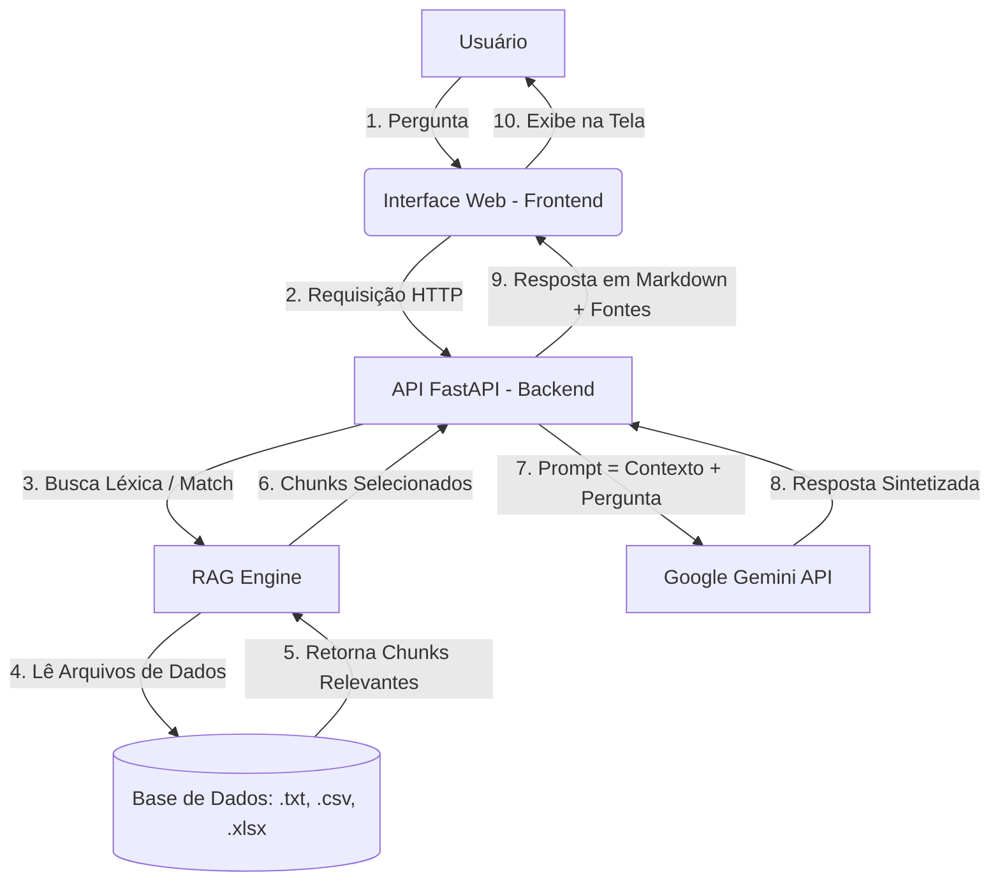

# PrimeAssist AI 🤖💊

O **PrimeAssist AI** é um assistente virtual inteligente desenvolvido especificamente para a **PrimePharma**. Ele foi projetado para responder a dúvidas de clientes e colaboradores de forma precisa e natural, baseando-se exclusivamente na base de dados e documentos internos da empresa (como políticas internas, tabelas de preços e relatórios de estoque).

O projeto implementa uma arquitetura **RAG (Retrieval-Augmented Generation)** local que lê arquivos de texto (`.txt`) e planilhas (`.csv`, `.xlsx`), busca as informações mais relevantes de acordo com a pergunta do usuário e utiliza a API do **Google Gemini** para consolidar a resposta final em linguagem natural.

---

## 🛠️ Arquitetura da Solução

A solução segue o fluxo clássico de **RAG (Geração Aumentada de Recuperação)** estruturado em três camadas:



### Detalhes de Funcionamento das Camadas:

1. **Camada de Dados (Knowledge Base)**:
   - Os documentos são armazenados em `backend/data/`.
   - Suporta arquivos de texto plano (`.txt`) e planilhas (`.csv`, `.xlsx`).
2. **Motor RAG Local (`rag.py`)**:
   - **Parsing e Chunking**: Divide arquivos `.txt` por parágrafos (respeitando o limite de caracteres) e planilhas por linhas (convertendo cada registro/linha em um bloco textual indexado).
   - **Indexação & Recuperação**: Analisa o texto das perguntas do usuário limpando stopwords e aplica uma fórmula de relevância baseada na sobreposição de palavras (Word Overlap) e correspondência exata de termos para selecionar os 5 blocos de texto mais relevantes.
3. **Backend API (`main.py`)**:
   - Desenvolvido em **FastAPI**, expõe endpoints para conversação, listagem, upload e exclusão de documentos da base.
   - Constrói um prompt contendo regras estritas do sistema (impedindo alucinações e respostas fora do contexto oficial da PrimePharma) e injeta os blocos de dados recuperados como o contexto de verdade para o modelo **Gemini 1.5 Flash**.
4. **Interface Visual (Frontend)**:
   - Single Page Application (SPA) construída com **HTML, CSS (Vanilla) e JavaScript**.
   - Contém um chat interativo (com suporte a histórico), gerenciador de documentos (upload e exclusão em tempo real) e uma aba de configurações segura para inserir a chave de API do Gemini localmente no navegador.

---

## 🚀 Tecnologias e Ferramentas Utilizadas

* **Linguagem Principal**: [Python 3.10+](https://www.python.org/)
* **Framework Web (Backend)**: [FastAPI](https://fastapi.tiangolo.com/) com servidor assíncrono [Uvicorn](https://www.uvicorn.org/)
* **Manipulação de Dados**: [Pandas](https://pandas.pydata.org/) e [OpenPyXL](https://openpyxl.readthedocs.io/en/stable/)
* **Processamento de Linguagem Natural / IA**: [Google Generative AI SDK](https://github.com/google/generative-ai-python) (Modelo `gemini-1.5-flash`)
* **Interface do Usuário (Frontend)**: HTML5, CSS3 clássico (Design moderno com Dark Mode) e JavaScript assíncrono (Fetch API)

---

## 💻 Instruções para Executar o Projeto

Siga os passos abaixo para configurar e rodar o projeto localmente em sua máquina.

### Pré-requisitos
* Python 3.10 ou superior instalado.
* Uma chave de API do Google Gemini (pode ser gerada gratuitamente no [Google AI Studio](https://aistudio.google.com/)).

### 1. Clonar e Acessar o Projeto
Navegue até o diretório do projeto:
```bash
cd /home/sales/.gemini/antigravity/scratch/primeassist_ai
```

### 2. Configurar o Ambiente Virtual (venv)
Crie o ambiente virtual e ative-o:

**No Linux/macOS:**
```bash
python3 -m venv venv
source venv/bin/activate
```

**No Windows (Prompt de Comando):**
```cmd
venv\Scripts\activate
```

### 3. Instalar Dependências
Instale todas as bibliotecas necessárias listadas no `requirements.txt`:
```bash
pip install -r requirements.txt
```

### 4. Executar o Servidor Backend
Inicie a aplicação FastAPI com o Uvicorn:
```bash
python backend/main.py
```
O servidor estará rodando em `http://localhost:8000`.

### 5. Acessar a Aplicação
Abra o seu navegador de preferência e acesse:
```
http://localhost:8000
```
*(A API do FastAPI monta e serve os arquivos do frontend automaticamente no endereço raiz `/`)*

> [!NOTE]
> Ao abrir o chat, clique no ícone de engrenagem (**Configurações**) e insira sua **Chave de API do Gemini** para que o assistente consiga responder a partir do modelo LLM. Caso prefira, você também pode exportar a chave em seu terminal antes de rodar o servidor: `export GEMINI_API_KEY="sua_chave_aqui"`.

---

## ❓ Exemplos de Perguntas e Respostas do Agente

O PrimeAssist AI responde a perguntas operacionais e de estoque baseado nos documentos que estão em `backend/data/`:

### Exemplos de perguntas que o agente consegue responder:
1. **Sobre Estoque e Preço**:
   * *"Qual é o preço do Aradois e quanto temos em estoque?"*
   * *"Vocês vendem Amoxil? Precisa de receita?"*
   * *"Qual é o valor da Insulina Lantus?"*
2. **Sobre Políticas de Troca e Devolução**:
   * *"Comprei um Roacutan mas me arrependi. Posso devolver?"*
   * *"Posso devolver um medicamento que precisa de geladeira (termolábil)?"*
   * *"Qual o prazo de reembolso para pagamentos via Pix?"*
3. **Sobre Diretrizes Gerais e Funcionamento**:
   * *"Se eu fizer um pedido hoje às 11h na Grande São Paulo, quando ele é entregue?"*
   * *"Qual o valor mínimo para frete grátis para Minas Gerais?"*
   * *"Qual é o telefone do SAC de vocês?"*

---

### Exemplos reais de respostas geradas pelo agente:

#### Exemplo 1: Dúvida sobre estoque e receita
> **Usuário:** *"Temos Ritalina em estoque? Quanto custa e precisa de receita?"*
>
> **PrimeAssist AI:** 
> Sim, temos a **Ritalina 10mg** em estoque com **15 unidades** disponíveis. O preço unitário é de **R$ 72,00**. 
> 
> A compra exige a apresentação e entrega física da Notificação de Receita (tipo A, B ou Especial) no ato da entrega ou retirada, necessitando de validação física pelo farmacêutico responsável.

#### Exemplo 2: Dúvida sobre devolução (regra de termolábil)
> **Usuário:** *"Posso trocar uma insulina que comprei por engano?"*
>
> **PrimeAssist AI:** 
> Não. Medicamentos termolábeis (como a **Insulina Lantus Solostar**, que exige refrigeração constante entre 2°C e 8°C) **não estão sujeitos a troca ou devolução** após saírem do estabelecimento comercial ou serem entregues ao cliente. Essa política visa garantir a segurança sanitária e a eficácia terapêutica dos produtos.

#### Exemplo 3: Pergunta fora do escopo / sem informações na base
> **Usuário:** *"Qual o valor do remédio para dor de cabeça Dipirona?"*
>
> **PrimeAssist AI:** 
> Desculpe, não encontrei essa informação nos documentos oficiais da PrimePharma.
