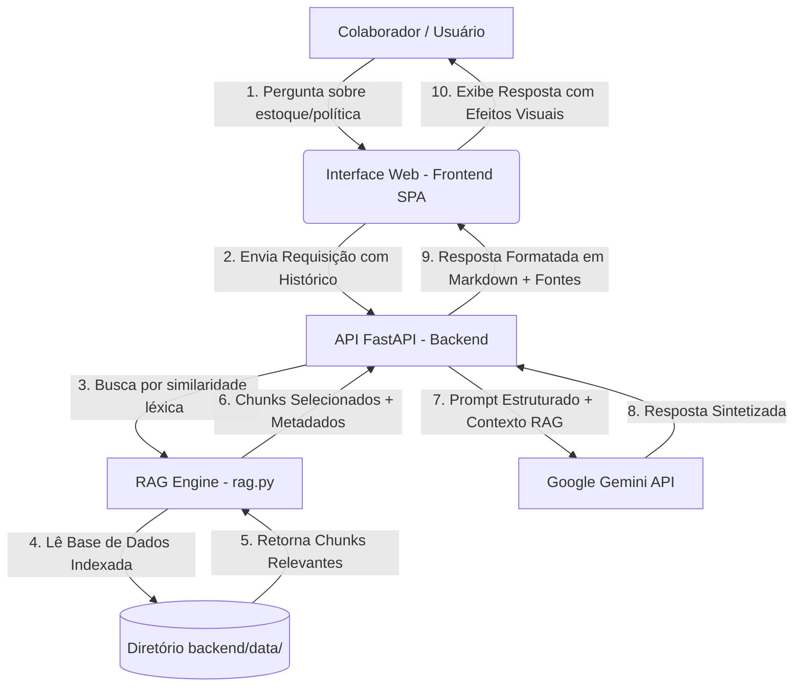

# PrimeAssist AI 🤖💊

O **PrimeAssist AI** é um assistente virtual inteligente corporativo desenvolvido sob medida para a **PrimePharma**. Ele foi projetado para responder a dúvidas operacionais de colaboradores e clientes de forma precisa, natural e contextualizada, baseando-se exclusivamente na base de documentos oficiais e planilhas internas da empresa.

O projeto implementa uma arquitetura **RAG (Retrieval-Augmented Generation)** local que lê arquivos estruturados (`.csv`, `.xlsx`), documentos em formato `.pdf` e arquivos `.txt`. O motor de busca recupera as informações mais relevantes em tempo real e utiliza a API do **Google Gemini (modelo `gemini-3.5-flash`)** para sintetizar a resposta final em linguagem natural, citando as fontes oficiais de consulta.

---

## 🏢 Sobre a PrimePharma

Fundada em **2012** em Salvador, Bahia, a **PrimePharma** é uma rede regional de farmácias guiada pelo slogan *"Confiança e cuidado para você."*
* **Presença Física**: 18 lojas físicas distribuídas por Salvador e Região Metropolitana.
* **Capital Humano**: Aproximadamente 320 colaboradores, incluindo atendentes, farmacêuticos, operadores de caixa, estoquistas e equipe administrativa.
* **Linha de Produtos**: Medicamentos de marca, medicamentos genéricos, higiene pessoal, cosméticos, dermocosméticos, vitaminas, suplementos, itens infantis e equipamentos de saúde (termômetros, aparelhos de pressão, etc.).

---

## 🛠️ Arquitetura da Solução RAG

A solução segue o fluxo clássico de **Geração Aumentada de Recuperação (RAG)** estruturado em três camadas:



### Detalhes das Camadas:

1. **Base de Conhecimento (Knowledge Base)**:
   * Armazenada no diretório `backend/data/`.
   * Contém os procedimentos operacionais padrão (POPs) em formato **PDF** e o controle de estoque/vendas em **CSV**.
2. **Motor RAG Local (`rag.py`)**:
   * **Processador de Documentos**: Extrai o conteúdo textual de arquivos PDF usando a biblioteca `pypdf`, linhas de planilhas com `pandas` e parágrafos de arquivos TXT.
   * **Indexador e Recuperador**: Realiza buscas textuais avançadas baseadas na frequência e relevância de termos (TF/Word Overlap) com higienização de stopwords para selecionar os **5 blocos de contexto** mais pertinentes à pergunta do usuário.
3. **Backend API (`main.py`)**:
   * Desenvolvido em **FastAPI**, expõe endpoints para conversação, upload, listagem e exclusão de documentos.
   * Define instruções de sistema rígidas para o **Gemini 3.5 Flash**, proibindo o uso de conhecimento externo ou suposições (alucinações).
4. **Interface SPA (Frontend)**:
   * Interface responsiva, moderna e dinâmica construída em HTML5, CSS3 clássico (com Glassmorphism e Dark Mode) e JavaScript.
   * Contém uma tela de carregamento corporativa (Splash Screen) de **4 segundos** com a logomarca da PrimePharma.

---

## 📄 Base de Documentos Oficiais da PrimePharma

O cérebro do assistente é alimentado por 8 arquivos indexados no backend:

### 📔 Manuais e Procedimentos Operacionais Padrão (POPs)
* **`Doc01_Sobre_a_PrimePharma.pdf`**: Apresenta a história da rede, slogan oficial, áreas de atuação e diferenciais competitivos.
* **`Doc02_Manual_do_Colaborador.pdf` (Código: MP-001)**: Define a missão, visão, valores corporativos e diretrizes sobre conduta profissional, jornada de trabalho, segurança da informação e conformidade com a LGPD.
* **`Doc03_Procedimento_de_Atendimento_ao_Cliente.pdf` (Código: POP-ATD-001)**: Estabelece as etapas do fluxo de atendimento, critérios para atendimento prioritário e a regra de que dúvidas técnicas de medicamentos devem ser encaminhadas ao **Farmacêutico Responsável**.
* **`Doc04_Procedimento_de_Troca_e_Devoluções.pdf` (Código: POP-TDV-001)**: Normatiza os prazos e condições para trocas e devoluções (exigindo comprovante de compra). Estipula que **medicamentos termolábeis** (que necessitam de refrigeração como a Insulina Lantus) não podem ser devolvidos para garantir a segurança sanitária.
* **`Doc05_Programa_de_Fidelidade_Prime+.pdf` (Código: POP-PFD-001)**: Normatiza o cadastro e as regras para o programa de pontos, promoções e resgate de ofertas personalizadas.
* **`Doc06_Procedimento_de_Caixa.pdf` (Código: POP-CX-001)**: Detalha as rotinas de abertura, registro de itens, consulta ao Prime+, cancelamentos, sangrias (retiradas parciais de dinheiro) e fechamento do caixa com o gerente da loja.

### 📊 Tabelas de Dados Estruturados
* **`Plan01_Resumo_Vendas_Ultimos_3_Meses.csv`**: Histórico mensal contendo o código do produto, nome, estoque atual, estoque mínimo recomendado e quantidade vendida nos meses de Abril, Maio e Junho de 2026.
* **`Plan02_Controle_de_Estoque.csv`**: Tabela operacional contendo os códigos dos produtos, descrição (ex: *Paracetamol 750 mg*, *Ritalina 10 mg*), categoria (Medicamento, Dermocosmético, Suplemento, etc.), quantidade em estoque, lote de fabricação e data de validade.

---

## 💻 Configuração e Execução Local

### Pré-requisitos
* Python 3.10 ou superior.
* Uma chave de API do Gemini (obtida gratuitamente no [Google AI Studio](https://aistudio.google.com/)).

### 1. Preparar o Ambiente
Navegue até o diretório raiz e crie o ambiente virtual:
```bash
cd /home/sales/.gemini/antigravity/scratch/primeassist_ai
python3 -m venv venv
source venv/bin/activate
```

### 2. Instalar Dependências
```bash
pip install -r requirements.txt
```

### 3. Executar a Aplicação

Você pode executar o projeto de duas formas:

#### Opção A: Interface Streamlit (Recomendada para Deploy na Nuvem)
```bash
streamlit run app.py
```
Acesse no navegador: **`http://localhost:8501`**.

#### Opção B: Servidor FastAPI + Frontend SPA
```bash
python backend/main.py
```
O servidor e a interface frontend estarão disponíveis em: **`http://localhost:8000`**.

> [!TIP]
> Ao acessar o sistema pela primeira vez, insira sua chave de API do Gemini na barra lateral ou nas Configurações. Ela ficará salva de forma segura.

---

## 🚀 Deploy no Streamlit Community Cloud

Para colocar o **PrimeAssist AI** no ar gratuitamente no **Streamlit Cloud**:

1. **Suba as alterações para o seu repositório GitHub**:
   ```bash
   git add .
   git commit -m "Adiciona suporte ao deploy no Streamlit Cloud"
   git push origin main
   ```
2. **Acesse o Streamlit Community Cloud**:
   * Entre em [share.streamlit.io](https://share.streamlit.io/) e faça login com sua conta do GitHub.
3. **Crie um Novo App (`New App`)**:
   * **Repository**: selecione `marcossalesdev/prime_assist_ai`
   * **Branch**: `main`
   * **Main file path**: `app.py` (ou `streamlit_app.py`)
4. **Configurar a Chave de API nos Secrets (Opcional, mas recomendado)**:
   * Clique em **Advanced settings...** > **Secrets**.
   * Adicione sua chave do Google Gemini:
     ```toml
     GEMINI_API_KEY = "AIzaSy..."
     ```
5. **Clique em `Deploy!`** 🚀
   * O Streamlit Cloud instalará as dependências do `requirements.txt` e iniciará o aplicativo com o motor RAG pronto para consultas!

---

## ❓ Casos de Uso e Exemplos de Consultas

O PrimeAssist AI utiliza a base de conhecimento integrada para responder com precisão e agilidade. Abaixo estão os principais exemplos de consultas recomendadas, divididos por área:

### 📄 Documentação
* **Como realizar uma sangria de caixa?**
* **Qual é a política de trocas da PrimePharma?**
* **Qual é a missão da empresa?**
* **O que fazer em caso de divergência de caixa?**

### 📦 Estoque
* **Qual é a validade do Omeprazol?**
* **Quantas unidades de Paracetamol existem em estoque?**
* **Qual é o lote do produto MED001?**
* **Quais produtos pertencem à categoria Higiene?**

### 💰 Vendas
* **Qual foi o produto mais vendido nos últimos três meses?**
* **Qual produto teve menor volume de vendas?**
* **Qual é o estoque atual da Dipirona?**
* **Quais produtos estão abaixo do estoque mínimo?**

---

## 💬 Exemplos de Respostas do Agente

Para ilustrar o funcionamento prático do **PrimeAssist AI** e a formatação das suas respostas baseadas no contexto RAG (Retrieval-Augmented Generation) e na síntese da API do Gemini, veja alguns exemplos reais de interação:

### 1. Consulta de Políticas Operacionais (Documentação)
> **Usuário:** Como realizar uma sangria de caixa?
>
> **PrimeAssist AI:**
> A sangria consiste na retirada parcial dos valores em dinheiro existentes no caixa para reduzir o volume de numerário disponível durante o expediente. Segundo as diretrizes da PrimePharma, o procedimento deve seguir estas etapas:
> 
> 1. **Solicitar autorização** do gerente da loja.
> 2. **Registrar a operação** de sangria no sistema operacional do caixa.
> 3. **Conferir o valor** que foi retirado fisicamente.
> 4. **Acondicionar o numerário** retirado seguindo o procedimento interno específico da sua unidade.
> 5. **Registrar a identificação** do colaborador responsável por realizar a operação.
> 
> **Fontes consultadas:**
> * `Doc06_Procedimento_de_Caixa.pdf` (Código: POP-CX-001) - Seção 8 (*Sangria de Caixa*)

---

### 2. Consulta de Estoque e Lotes (Dados Operacionais)
> **Usuário:** Qual é a validade do Omeprazol e quantas unidades temos em estoque?
>
> **PrimeAssist AI:**
> Com base no controle de estoque atualizado da PrimePharma, temos duas versões do Omeprazol registradas na base:
> 
> 1. **Omeprazol 20 mg** (Medicamento de Referência, Código: `MED004`):
>    * **Estoque Atual**: 110 caixas
>    * **Lote**: `L250704`
>    * **Validade**: 05/01/2028
> 2. **Omeprazol Genérico 20 mg** (Código: `GEN003`):
>    * **Estoque Atual**: 92 caixas
>    * **Lote**: `G250703`
>    * **Validade**: 15/01/2028
> 
> **Fontes consultadas:**
> * `Plan02_Controle_de_Estoque.csv` - Registros de estoque de Medicamentos e Genéricos

---

### 3. Análise de Desempenho de Vendas (Dados Consolidados)
> **Usuário:** Qual foi o produto mais vendido nos últimos três meses?
>
> **PrimeAssist AI:**
> O produto mais vendido no consolidado de vendas dos meses de Abril, Maio e Junho de 2026 foi a **Vitamina C** (Código: `SUP001`), registrando um total de **462 unidades vendidas** (sendo 246 unidades em Maio e 216 em Junho).
> 
> Outros produtos que apresentaram desempenho de vendas de destaque no período foram:
> * **Ibuprofeno Genérico 600 mg** (Código: `GEN006`): 460 unidades vendidas.
> * **Hidroclorotiazida 25 mg** (Código: `MED013`): 458 unidades vendidas.
> 
> **Fontes consultadas:**
> * `Plan01_Resumo_Vendas_Ultimos_3_Meses.csv` - Histórico consolidado de vendas do último trimestre
